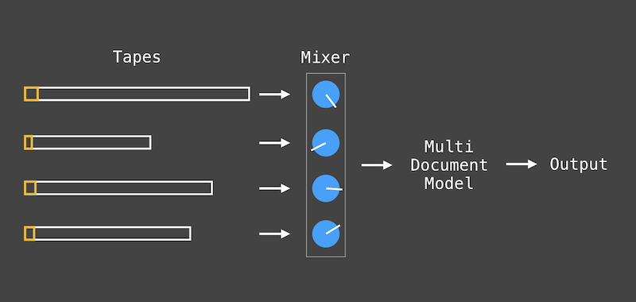

> When the winter nights came on, they used to bring home turf from the precipice Of someone immense in passion, pulse, and power, The genius of poets of old lands, they do not think they slighted upon any account; and they did not see, but being blind, believed.

[Nanogenmo](https://nanogenmo.github.io) (National Novel Generation Month) is an annual collaborative activity where participants are encouraged to write code to generate a novel, then share the output and code.

The nanogenmo definition of novel is very broad, the only requirement is that the output more than 50k words.

The quoted section above is the opening of my generated novel.

- [Full text of generated novel](/doc/itp/catn/nanogenmo/novel_1574472414.txt)

## Methodology

My methodology was inspired by the world of audio engineering, specifically audio mixing and modulation (cyclical) effects.

I focused on the ability to make smaller Markov models and combine them.

- Input text is preprocessed to remove names and gendered pronouns to make models overlap more
- An input text is treated as a sort of tape by splitting it into many small, sequential models
- A moving window is used as a sort of tape head
  - The window size for each track is normalized to the document length
- Several tapes are read from in parallel and mixed them down into a single model
  - Each track is weighted by total sentence length, longer documents have more weight
- A single sentence is printed at a time from the mixed model

For inputs, I used available Guttenberg texts in NLTK, a Python package for NLP.

- 'austen-emma.txt',
- 'austen-persuasion.txt',
- 'austen-sense.txt',
- 'blake-poems.txt',
- 'bryant-stories.txt',
- 'burgess-busterbrown.txt',
- 'carroll-alice.txt',
- 'chesterton-ball.txt',
- 'chesterton-brown.txt',
- 'chesterton-thursday.txt',
- 'edgeworth-parents.txt',
- 'milton-paradise.txt',
- 'shakespeare-caesar.txt',
- 'shakespeare-hamlet.txt',
- 'shakespeare-macbeth.txt',
- 'whitman-leaves.txt'

## Next Steps

The next step would be to develop modulation effects.

First, I would need modulation sources eg a sine or triangle wave signal. Then, I could modulate variables such as tape head width and model weight.

Alternatively, it might be interesting to try replicating time based effects such as delay since this might introduce some interesting recursive effects.
